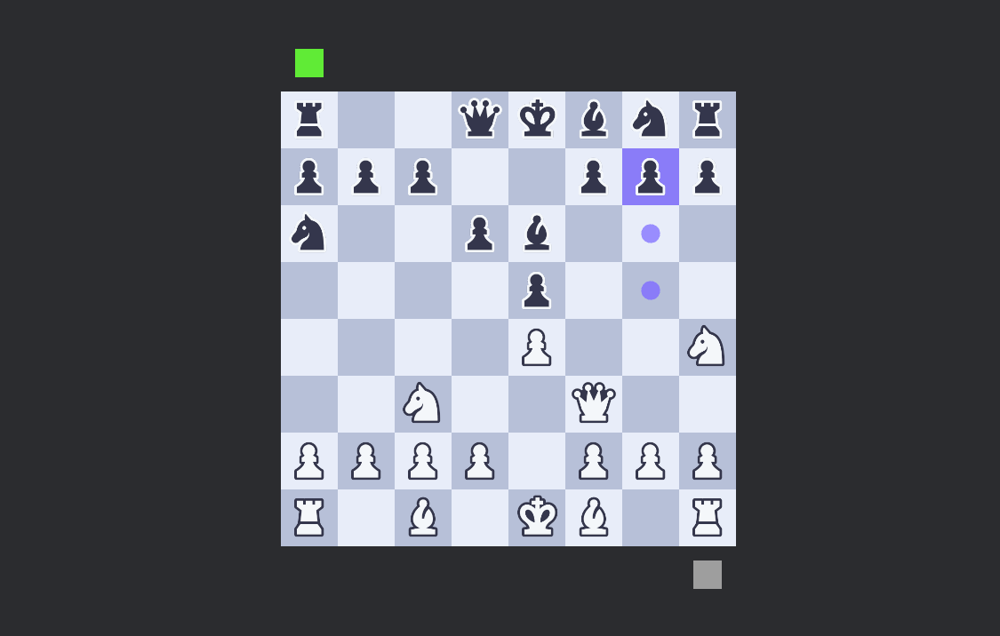

# Yet another chess

## A simple chess game made with rust.

I have created yet another chess game to try out [bevy](https://bevyengine.org) features and get into ecs architecture for game development. I will write my detailed thoughts later.

### TODO:
- Build a bot with a simple algorithm
- Multiplayer support to play online

*Keep following and give me ideas/suggestions*

### Screenshots

